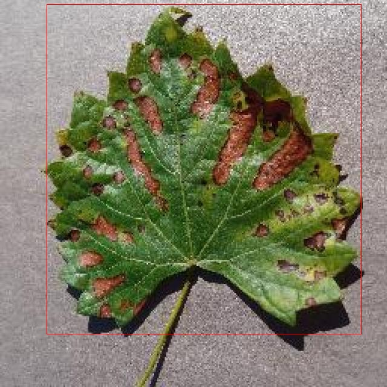

# 葡萄叶病害检测检测系统源码分享
 # [一条龙教学YOLOV8标注好的数据集一键训练_70+全套改进创新点发刊_Web前端展示]

### 1.研究背景与意义

项目参考[AAAI Association for the Advancement of Artificial Intelligence](https://gitee.com/qunshansj/projects)

项目来源[AACV Association for the Advancement of Computer Vision](https://gitee.com/qunmasj/projects)

研究背景与意义

随着全球农业的快速发展，作物病害的监测与管理已成为保障农业生产和食品安全的重要课题。葡萄作为一种经济价值极高的水果，其种植面积和产量在全球范围内不断扩大。然而，葡萄叶病害的发生不仅影响了葡萄的生长和产量，还对葡萄的品质和市场价值造成了严重影响。因此，及时、准确地检测和识别葡萄叶病害，对于提高葡萄种植的经济效益和保障食品安全具有重要的现实意义。

近年来，计算机视觉技术的快速发展为农业病害检测提供了新的解决方案。尤其是基于深度学习的目标检测算法，如YOLO（You Only Look Once）系列，因其高效性和准确性而受到广泛关注。YOLOv8作为该系列的最新版本，具备了更强的特征提取能力和更快的推理速度，能够在复杂的环境中实现实时目标检测。因此，基于改进YOLOv8的葡萄叶病害检测系统的研究，具有重要的理论价值和实际应用前景。

本研究将利用一个包含1600张图像的葡萄叶数据集，该数据集涵盖了四种类别的叶片状态：黑斑病、黑腐病、疫病和健康叶片。这些类别的划分不仅为模型的训练提供了丰富的样本，也为后续的病害分析和防治措施的制定提供了基础数据支持。通过对这些图像的深度学习处理，研究将探讨如何提高YOLOv8在葡萄叶病害检测中的识别精度和效率，进而实现对不同病害的快速分类和定位。

此外，随着气候变化和病虫害的不断演变，传统的人工检测方法已难以满足现代农业的需求。基于改进YOLOv8的自动化检测系统，能够有效减少人工成本，提高检测效率，帮助农民及时发现和处理病害，从而降低病害对葡萄产量和品质的影响。同时，该系统的推广应用也将推动智能农业的发展，为实现精准农业和可持续发展目标提供技术支持。

总之，基于改进YOLOv8的葡萄叶病害检测系统的研究，不仅能够为葡萄种植者提供科学的病害监测工具，提升农业生产的智能化水平，还将为相关领域的研究提供新的思路和方法。通过深入探讨葡萄叶病害的自动检测技术，期望能够为农业病害管理提供有效的解决方案，促进农业的可持续发展。

### 2.图片演示


##### 注意：由于此博客编辑较早，上面“2.图片演示”和“3.视频演示”展示的系统图片或者视频可能为老版本，新版本在老版本的基础上升级如下：（实际效果以升级的新版本为准）

  （1）适配了YOLOV8的“目标检测”模型和“实例分割”模型，通过加载相应的权重（.pt）文件即可自适应加载模型。

  （2）支持“图片识别”、“视频识别”、“摄像头实时识别”三种识别模式。

  （3）支持“图片识别”、“视频识别”、“摄像头实时识别”三种识别结果保存导出，解决手动导出（容易卡顿出现爆内存）存在的问题，识别完自动保存结果并导出到tempDir中。

  （4）支持Web前端系统中的标题、背景图等自定义修改，后面提供修改教程。

  另外本项目提供训练的数据集和训练教程,暂不提供权重文件（best.pt）,需要您按照教程进行训练后实现图片演示和Web前端界面演示的效果。

### 3.视频演示

[3.1 视频演示](https://www.bilibili.com/video/BV1L6teeQED9/)

### 4.数据集信息展示

##### 4.1 本项目数据集详细数据（类别数＆类别名）

nc: 4
names: ['Black Measles', 'Black Rot', 'blight fungus', 'healthy leaf']


##### 4.2 本项目数据集信息介绍

数据集信息展示

在现代农业中，病害检测的准确性与效率直接影响着作物的产量和质量。为此，构建一个高效的葡萄叶病害检测系统显得尤为重要。本研究所采用的数据集名为“grape leaf dataset”，其主要目的是为改进YOLOv8模型在葡萄叶病害检测中的应用提供坚实的数据基础。该数据集包含四个主要类别，分别是“Black Measles”、“Black Rot”、“blight fungus”和“healthy leaf”。这些类别的选择不仅涵盖了葡萄叶常见的病害类型，也为模型的训练和评估提供了丰富的样本。

“Black Measles”是一种常见的葡萄叶病害，其特征表现为叶片上出现黑色斑点，严重时会导致叶片枯萎，影响光合作用。通过对这一类别的样本进行标注和分析，模型能够学习到黑色斑点的形态特征及其在不同生长阶段的表现，从而提高对该病害的识别能力。

“Black Rot”则是另一种影响葡萄生长的重要病害，其特征主要表现为叶片和果实上的黑色腐烂斑点。该病害不仅影响叶片的健康，还可能导致果实的减产。因此，数据集中包含的“Black Rot”样本将帮助模型掌握其特征，并在实际应用中快速识别出受影响的叶片。

“blight fungus”是指由真菌引起的病害，通常表现为叶片上出现褐色或黑色的斑点，并伴随叶片的枯萎。该类别的样本在数据集中同样占据重要地位，通过对其特征的学习，模型将能够更好地识别出真菌感染的叶片，进而为农民提供及时的预警信息。

最后，“healthy leaf”类别的样本则为模型提供了一个健康叶片的基准，帮助其在识别病害时进行对比。这一类别的样本不仅有助于提高模型的准确性，还能有效降低误报率，确保农民在实际应用中能够获得可靠的病害检测结果。

数据集的构建过程注重样本的多样性和代表性，确保每个类别的样本数量均衡，涵盖不同生长阶段和环境条件下的叶片特征。这种全面的样本选择将为YOLOv8模型的训练提供丰富的数据支持，使其在实际应用中能够更好地适应不同的场景。

在数据预处理阶段，数据集还经过了标准化和增强处理，以提高模型的泛化能力。通过旋转、缩放、裁剪等技术，数据集中的样本数量得到了有效增加，进一步提升了模型在实际应用中的鲁棒性。

综上所述，“grape leaf dataset”不仅为改进YOLOv8的葡萄叶病害检测系统提供了坚实的数据基础，还通过多样化的样本和全面的类别覆盖，确保了模型在实际应用中的高效性和准确性。这一数据集的构建与应用，将为葡萄种植者提供强有力的技术支持，助力现代农业的可持续发展。




### 5.全套项目环境部署视频教程（零基础手把手教学）

[5.1 环境部署教程链接（零基础手把手教学）](https://www.ixigua.com/7404473917358506534?logTag=c807d0cbc21c0ef59de5)


[5.2 安装Python虚拟环境创建和依赖库安装视频教程链接（零基础手把手教学）](https://www.ixigua.com/7404474678003106304?logTag=1f1041108cd1f708b01a)

### 6.手把手YOLOV8训练视频教程（零基础小白有手就能学会）

[6.1 手把手YOLOV8训练视频教程（零基础小白有手就能学会）](https://www.ixigua.com/7404477157818401292?logTag=d31a2dfd1983c9668658)

### 7.70+种全套YOLOV8创新点代码加载调参视频教程（一键加载写好的改进模型的配置文件）

[7.1 70+种全套YOLOV8创新点代码加载调参视频教程（一键加载写好的改进模型的配置文件）](https://www.ixigua.com/7404478314661806627?logTag=29066f8288e3f4eea3a4)

### 8.70+种全套YOLOV8创新点原理讲解（非科班也可以轻松写刊发刊，V10版本正在科研待更新）

由于篇幅限制，每个创新点的具体原理讲解就不一一展开，具体见下列网址中的创新点对应子项目的技术原理博客网址【Blog】：


[8.1 70+种全套YOLOV8创新点原理讲解链接](https://gitee.com/qunmasj/good)

### 9.系统功能展示（检测对象为举例，实际内容以本项目数据集为准）

图9.1.系统支持检测结果表格显示

  图9.2.系统支持置信度和IOU阈值手动调节

  图9.3.系统支持自定义加载权重文件best.pt(需要你通过步骤5中训练获得)

  图9.4.系统支持摄像头实时识别

  图9.5.系统支持图片识别

  图9.6.系统支持视频识别

  图9.7.系统支持识别结果文件自动保存

  图9.8.系统支持Excel导出检测结果数据


### 10.原始YOLOV8算法原理

原始YOLOv8算法原理

YOLOv8算法是目标检测领域中的一项重要进展，由Ultralytics团队在YOLOv5的基础上进行了一系列创新和改进，旨在提升目标检测的精度和效率。自2023年1月提出以来，YOLOv8凭借其卓越的性能，迅速成为研究者和开发者关注的焦点。该算法的设计理念源于对前几代YOLO模型的深刻理解和实际应用反馈，结合了最新的技术趋势和理论研究，形成了一种更为高效和灵活的目标检测解决方案。

首先，YOLOv8在数据预处理方面延续了YOLOv5的成功经验，采用了多种数据增强技术，如马赛克增强、混合增强、空间扰动和颜色扰动等。这些技术不仅提升了模型的鲁棒性和泛化能力，还帮助模型在面对多样化的输入数据时，能够更好地学习到有效的特征。然而，YOLOv8在训练的最后10个epoch中停止使用马赛克增强，以避免破坏数据的真实分布，确保模型学习到更为准确的信息。

在网络结构上，YOLOv8对主干网络进行了优化，特别是将原有的C3模块替换为C2f模块。C2f模块的设计灵感来源于YOLOv7中的ELAN结构，通过引入更多的跳层连接，C2f模块能够有效增强梯度流动，促进信息的传递和融合，从而提高特征提取的效率和准确性。此外，YOLOv8依然保留了空间金字塔池化（SPPF）模块，这一设计不仅保持了模型的性能，还显著减少了执行时间，进一步提升了推理速度。

在颈部网络中，YOLOv8同样将所有的C3模块更改为C2f模块，并删除了上采样之前的卷积连接层，这一调整使得特征融合过程更加高效。通过优化网络结构，YOLOv8在多尺度特征融合方面表现出色，能够更好地捕捉到不同尺度目标的特征信息，从而提升检测精度。

YOLOv8的检测头结构采用了“解耦头”的设计理念，这一创新使得分类和定位任务能够在两个并行的分支中独立进行。具体而言，分类分支专注于提取特征图中的类别信息，而定位分支则专注于边界框的精确定位。这种结构的引入，不仅加快了模型的收敛速度，还显著提高了预测的精度。通过使用无锚框结构，YOLOv8能够直接预测目标的中心位置，并引入任务对齐学习（TAL）机制，进一步优化正负样本的区分。

在损失函数的设计上，YOLOv8采用了新的策略，通过变焦损失计算分类损失，并使用数据平均保真度损失和完美交并比损失来计算边界框损失。这种多维度的损失计算方式，使得YOLOv8在目标检测任务中能够更加准确地评估模型的性能，确保分类和定位的双重优化。

YOLOv8在标签分配策略上也进行了创新，采用了与YOLOv6相同的动态标签分配策略TOOD。这一策略通过动态调整正负样本的匹配方式，避免了传统方法中对候选框的依赖，进而提高了模型在不同数据集上的适应性和准确性。YOLOv8的损失函数主要包括类别损失和位置损失，其中类别损失采用了变焦损失（VFL），而回归损失则结合了CIoULoss与DFLLoss。这种设计使得模型在处理高质量样本时，能够更加聚焦于那些具有较高GTIoU的正样本，从而有效提升整体的检测性能。

综合来看，YOLOv8在多个方面进行了创新和优化，使其在目标检测任务中展现出更为优越的性能。通过对数据预处理、网络结构、损失函数和标签分配策略的全面改进，YOLOv8不仅提高了检测精度，还增强了模型的实时性和适应性，特别适合于实时性要求较高的应用场景，如自动驾驶、监控系统和机器人视觉等领域。未来，随着YOLOv8的不断发展和完善，其在目标检测领域的应用潜力将进一步得到挖掘，成为更多实际应用中的首选解决方案。


### 11.项目核心源码讲解（再也不用担心看不懂代码逻辑）

#### 11.1 ui.py

以下是代码的核心部分，并附上详细的中文注释：

```python
import sys
import subprocess

def run_script(script_path):
    """
    使用当前 Python 环境运行指定的脚本。

    Args:
        script_path (str): 要运行的脚本路径

    Returns:
        None
    """
    # 获取当前 Python 解释器的路径
    python_path = sys.executable

    # 构建运行命令，使用 streamlit 运行指定的脚本
    command = f'"{python_path}" -m streamlit run "{script_path}"'

    # 执行命令
    result = subprocess.run(command, shell=True)
    
    # 检查命令执行结果，如果返回码不为0，则表示执行出错
    if result.returncode != 0:
        print("脚本运行出错。")

# 实例化并运行应用
if __name__ == "__main__":
    # 指定要运行的脚本路径
    script_path = "web.py"  # 这里可以直接指定脚本名称，假设它在当前目录下

    # 调用函数运行脚本
    run_script(script_path)
```

### 代码分析：
1. **导入模块**：
   - `sys`：用于访问与 Python 解释器相关的变量和函数。
   - `subprocess`：用于创建新进程、连接到它们的输入/输出/错误管道，并获得返回码。

2. **`run_script` 函数**：
   - 该函数接收一个脚本路径作为参数，并使用当前 Python 环境来运行该脚本。
   - 使用 `sys.executable` 获取当前 Python 解释器的路径。
   - 构建命令字符串，使用 `streamlit` 运行指定的脚本。
   - 使用 `subprocess.run` 执行命令，并检查返回码以确定脚本是否成功运行。

3. **主程序入口**：
   - 在 `if __name__ == "__main__":` 块中，指定要运行的脚本路径（`web.py`）。
   - 调用 `run_script` 函数来执行该脚本。

### 注意事项：
- 代码假设 `web.py` 文件在当前工作目录下，实际使用时可能需要根据具体路径进行调整。
- 如果脚本运行出错，程序会输出错误信息。

这个文件是一个名为 `ui.py` 的 Python 脚本，主要功能是通过当前的 Python 环境来运行一个指定的脚本。文件中首先导入了必要的模块，包括 `sys`、`os` 和 `subprocess`，这些模块提供了与系统交互的功能，特别是执行外部命令的能力。

在 `run_script` 函数中，首先获取当前 Python 解释器的路径，这样可以确保在正确的环境中运行脚本。接着，构建一个命令字符串，这个命令会调用 `streamlit` 来运行指定的脚本，脚本路径由参数 `script_path` 提供。使用 `subprocess.run` 方法来执行这个命令，`shell=True` 允许在 shell 中执行命令。

如果命令执行的返回码不为零，表示脚本运行过程中出现了错误，此时会打印出一条错误信息。

在文件的最后部分，使用 `if __name__ == "__main__":` 来判断当前模块是否是主程序。如果是，则指定要运行的脚本路径，这里使用了 `abs_path` 函数来获取 `web.py` 的绝对路径。最后，调用 `run_script` 函数来执行这个脚本。

整体来看，这个文件的作用是为一个 Streamlit 应用提供一个启动入口，通过调用 `web.py` 脚本来启动一个 web 应用。

#### 11.2 code\ultralytics\models\yolo\detect\__init__.py

以下是保留的核心部分代码，并添加了详细的中文注释：

```python
# 导入所需的模块
from .predict import DetectionPredictor  # 导入目标检测预测器
from .train import DetectionTrainer      # 导入目标检测训练器
from .val import DetectionValidator      # 导入目标检测验证器

# 定义模块的公开接口，允许外部访问这三个类
__all__ = "DetectionPredictor", "DetectionTrainer", "DetectionValidator"
```

### 代码详细注释：

1. **导入模块**：
   - `from .predict import DetectionPredictor`：从当前包的 `predict` 模块中导入 `DetectionPredictor` 类，该类用于进行目标检测的预测。
   - `from .train import DetectionTrainer`：从当前包的 `train` 模块中导入 `DetectionTrainer` 类，该类用于训练目标检测模型。
   - `from .val import DetectionValidator`：从当前包的 `val` 模块中导入 `DetectionValidator` 类，该类用于验证目标检测模型的性能。

2. **定义公开接口**：
   - `__all__` 是一个特殊变量，用于定义模块的公共接口。它是一个字符串元组，包含了可以被外部访问的类名。在这里，`DetectionPredictor`、`DetectionTrainer` 和 `DetectionValidator` 是可以被其他模块导入和使用的类。

这个程序文件是Ultralytics YOLO模型的一部分，主要用于目标检测。文件的开头包含了一条注释，说明了该项目的名称（Ultralytics YOLO）以及其使用的许可证类型（AGPL-3.0）。接下来，文件通过相对导入的方式引入了三个主要的类：`DetectionPredictor`、`DetectionTrainer`和`DetectionValidator`。这些类分别负责目标检测的不同阶段：预测、训练和验证。

`DetectionPredictor`类用于执行目标检测的预测任务，能够处理输入数据并输出检测结果。`DetectionTrainer`类则负责模型的训练过程，通常涉及数据加载、模型优化和参数调整等步骤。`DetectionValidator`类用于验证模型的性能，通常是在训练完成后对模型进行评估，以确保其在未见数据上的表现。

最后，`__all__`变量定义了模块的公共接口，指定了在使用`from module import *`时可以导入的类。这意味着当其他模块导入这个文件时，只会看到`DetectionPredictor`、`DetectionTrainer`和`DetectionValidator`这三个类，隐藏了其他可能存在的内部实现细节。整体来看，这个文件的结构简洁明了，清晰地组织了YOLO模型的核心功能模块。

#### 11.3 70+种YOLOv8算法改进源码大全和调试加载训练教程（非必要）\ultralytics\models\yolo\detect\__init__.py

以下是代码中最核心的部分，并附上详细的中文注释：

```python
# 导入必要的模块
from .predict import DetectionPredictor  # 导入检测预测器类
from .train import DetectionTrainer      # 导入检测训练器类
from .val import DetectionValidator      # 导入检测验证器类

# 定义模块的公开接口，指定可以被外部访问的类
__all__ = 'DetectionPredictor', 'DetectionTrainer', 'DetectionValidator'
```

### 注释说明：
1. **导入模块**：
   - `from .predict import DetectionPredictor`：从当前包的 `predict` 模块中导入 `DetectionPredictor` 类，该类负责进行目标检测的预测。
   - `from .train import DetectionTrainer`：从当前包的 `train` 模块中导入 `DetectionTrainer` 类，该类用于训练目标检测模型。
   - `from .val import DetectionValidator`：从当前包的 `val` 模块中导入 `DetectionValidator` 类，该类用于验证目标检测模型的性能。

2. **定义公开接口**：
   - `__all__` 是一个特殊的变量，用于定义模块的公共接口。当使用 `from module import *` 语句时，只有在 `__all__` 中列出的名称会被导入。这里列出了三个类，表明它们是该模块对外提供的功能。

这个程序文件是Ultralytics YOLO（You Only Look Once）模型的一部分，主要用于目标检测。文件的功能主要是导入和组织与检测相关的类和功能。

首先，文件开头的注释部分表明这是Ultralytics YOLO的代码，并且遵循AGPL-3.0许可证，这意味着代码是开源的，用户可以自由使用和修改，但需要遵循相应的许可证条款。

接下来，文件通过相对导入的方式引入了三个重要的类：`DetectionPredictor`、`DetectionTrainer`和`DetectionValidator`。这些类分别负责不同的功能：

- `DetectionPredictor`：用于目标检测的预测功能，能够对输入的图像进行处理并输出检测结果。
- `DetectionTrainer`：负责模型的训练过程，包含训练所需的各种方法和参数设置。
- `DetectionValidator`：用于验证模型的性能，通常在训练完成后对模型进行评估，以检查其在测试集上的表现。

最后，`__all__`变量定义了当使用`from module import *`语句时，模块将公开的接口。这里指定了`DetectionPredictor`、`DetectionTrainer`和`DetectionValidator`这三个类，使得它们可以被外部模块直接访问。

总体来说，这个文件的主要作用是作为一个模块的入口，整合了YOLOv8模型的检测、训练和验证功能，为用户提供了一个清晰的接口来使用这些功能。

#### 11.4 70+种YOLOv8算法改进源码大全和调试加载训练教程（非必要）\ultralytics\nn\extra_modules\kernel_warehouse.py

以下是代码中最核心的部分，并附上详细的中文注释：

```python
import torch
import torch.nn as nn
import torch.nn.functional as F

class Attention(nn.Module):
    def __init__(self, in_planes, reduction, num_static_cell, num_local_mixture, norm_layer=nn.BatchNorm1d,
                 cell_num_ratio=1.0, nonlocal_basis_ratio=1.0, start_cell_idx=None):
        super(Attention, self).__init__()
        # 计算隐藏层的通道数
        hidden_planes = max(int(in_planes * reduction), 16)
        self.kw_planes_per_mixture = num_static_cell + 1  # 每个混合的关键点数量
        self.num_local_mixture = num_local_mixture  # 本地混合数量
        self.kw_planes = self.kw_planes_per_mixture * num_local_mixture  # 总的关键点数量

        # 计算本地和非本地单元的数量
        self.num_local_cell = int(cell_num_ratio * num_local_mixture)
        self.num_nonlocal_cell = num_static_cell - self.num_local_cell
        self.start_cell_idx = start_cell_idx

        # 定义网络层
        self.avgpool = nn.AdaptiveAvgPool1d(1)  # 自适应平均池化
        self.fc1 = nn.Linear(in_planes, hidden_planes, bias=(norm_layer is not nn.BatchNorm1d))  # 全连接层
        self.norm1 = norm_layer(hidden_planes)  # 归一化层
        self.act1 = nn.ReLU(inplace=True)  # 激活函数

        # 根据非本地基数比率选择不同的映射方式
        if nonlocal_basis_ratio >= 1.0:
            self.map_to_cell = nn.Identity()  # 直接使用输入
            self.fc2 = nn.Linear(hidden_planes, self.kw_planes, bias=True)  # 第二个全连接层
        else:
            self.map_to_cell = self.map_to_cell_basis  # 使用基础映射
            self.num_basis = max(int(self.num_nonlocal_cell * nonlocal_basis_ratio), 16)  # 基础数量
            self.fc2 = nn.Linear(hidden_planes, (self.num_local_cell + self.num_basis + 1) * num_local_mixture, bias=False)
            self.fc3 = nn.Linear(self.num_basis, self.num_nonlocal_cell, bias=False)  # 处理非本地单元的全连接层
            self.basis_bias = nn.Parameter(torch.zeros([self.kw_planes], requires_grad=True).float())  # 基础偏置

        self.temp_bias = torch.zeros([self.kw_planes], requires_grad=False).float()  # 温度偏置
        self.temp_value = 0  # 温度值
        self._initialize_weights()  # 初始化权重

    def _initialize_weights(self):
        # 初始化网络层的权重
        for m in self.modules():
            if isinstance(m, nn.Linear):
                nn.init.kaiming_normal_(m.weight, mode='fan_out', nonlinearity='relu')  # Kaiming初始化
                if m.bias is not None:
                    nn.init.constant_(m.bias, 0)  # 偏置初始化为0
            if isinstance(m, nn.BatchNorm1d):
                nn.init.constant_(m.weight, 1)  # 批归一化权重初始化为1
                nn.init.constant_(m.bias, 0)  # 偏置初始化为0

    def forward(self, x):
        # 前向传播
        x = self.avgpool(x.reshape(*x.shape[:2], -1)).squeeze(dim=-1)  # 平均池化
        x = self.act1(self.norm1(self.fc1(x)))  # 通过全连接层、归一化和激活函数
        x = self.map_to_cell(self.fc2(x)).reshape(-1, self.kw_planes)  # 映射到单元
        x = x / (torch.sum(torch.abs(x), dim=1).view(-1, 1) + 1e-3)  # 归一化
        x = (1.0 - self.temp_value) * x.reshape(-1, self.kw_planes) + self.temp_value * self.temp_bias.to(x.device).view(1, -1)  # 温度调整
        return x.reshape(-1, self.kw_planes_per_mixture)[:, :-1]  # 返回结果

class KWconvNd(nn.Module):
    def __init__(self, in_planes, out_planes, kernel_size, stride=1, padding=0, dilation=1, groups=1,
                 bias=False, warehouse_id=None, warehouse_manager=None):
        super(KWconvNd, self).__init__()
        # 初始化卷积层的参数
        self.in_planes = in_planes  # 输入通道数
        self.out_planes = out_planes  # 输出通道数
        self.kernel_size = kernel_size  # 卷积核大小
        self.stride = stride  # 步幅
        self.padding = padding  # 填充
        self.dilation = dilation  # 膨胀
        self.groups = groups  # 分组卷积
        self.bias = nn.Parameter(torch.zeros([self.out_planes]), requires_grad=True).float() if bias else None  # 偏置
        self.warehouse_id = warehouse_id  # 仓库ID
        self.warehouse_manager = [warehouse_manager]  # 仓库管理器

    def forward(self, x):
        # 前向传播
        kw_attention = self.attention(x).type(x.dtype)  # 获取注意力权重
        batch_size = x.shape[0]  # 批大小
        x = x.reshape(1, -1, *x.shape[2:])  # 调整输入形状
        weight = self.warehouse_manager[0].take_cell(self.warehouse_id).reshape(self.cell_shape[0], -1).type(x.dtype)  # 获取权重
        aggregate_weight = torch.mm(kw_attention, weight)  # 权重聚合
        output = self.func_conv(x, weight=aggregate_weight, bias=None, stride=self.stride, padding=self.padding,
                                dilation=self.dilation, groups=self.groups * batch_size)  # 卷积操作
        output = output.view(batch_size, self.out_planes, *output.shape[2:])  # 调整输出形状
        if self.bias is not None:
            output = output + self.bias.reshape(1, -1, *([1]*self.dimension))  # 添加偏置
        return output  # 返回输出

# 其他卷积类和线性类继承自KWconvNd和KWLinear，省略具体实现

class Warehouse_Manager(nn.Module):
    def __init__(self, reduction=0.0625, cell_num_ratio=1, cell_inplane_ratio=1,
                 cell_outplane_ratio=1, sharing_range=(), nonlocal_basis_ratio=1,
                 norm_layer=nn.BatchNorm1d, spatial_partition=True):
        super(Warehouse_Manager, self).__init__()
        # 初始化仓库管理器的参数
        self.sharing_range = sharing_range  # 共享范围
        self.warehouse_list = {}  # 仓库列表
        self.reduction = reduction  # 减少比例
        self.spatial_partition = spatial_partition  # 空间分区
        self.cell_num_ratio = cell_num_ratio  # 单元数量比例
        self.cell_outplane_ratio = cell_outplane_ratio  # 输出通道比例
        self.cell_inplane_ratio = cell_inplane_ratio  # 输入通道比例
        self.norm_layer = norm_layer  # 归一化层
        self.nonlocal_basis_ratio = nonlocal_basis_ratio  # 非本地基数比例
        self.weights = nn.ParameterList()  # 权重列表

    def reserve(self, in_planes, out_planes, kernel_size=1, stride=1, padding=0, dilation=1, groups=1,
                bias=True, warehouse_name='default', enabled=True, layer_type='conv2d'):
        # 创建动态卷积层并记录其信息
        if not enabled:
            return nn.Conv2d(in_planes, out_planes, kernel_size, stride=stride, padding=padding, dilation=dilation,
                             groups=groups, bias=bias)  # 返回普通卷积层
        else:
            # 返回自定义的KWConv类
            return KWConv2d(in_planes, out_planes, kernel_size, stride=stride, padding=padding,
                             dilation=dilation, groups=groups, bias=bias,
                             warehouse_id=len(self.warehouse_list), warehouse_manager=self)

    def store(self):
        # 存储仓库中的权重
        for warehouse_name in self.warehouse_list.keys():
            warehouse = self.warehouse_list[warehouse_name]
            # 计算最大公约数和其他参数
            # 省略具体实现
            self.weights.append(nn.Parameter(torch.randn(...)))  # 添加权重

    def allocate(self, network):
        # 分配权重到网络中的卷积层
        for layer in network.modules():
            if isinstance(layer, KWconvNd):
                # 初始化注意力
                layer.init_attention(...)

    def take_cell(self, warehouse_idx):
        return self.weights[warehouse_idx]  # 返回指定仓库的权重
```

以上代码实现了一个带有注意力机制的卷积神经网络模块，并通过仓库管理器来管理卷积层的权重。注意力机制通过自适应池化和全连接层来生成权重，卷积层则使用这些权重进行卷积操作。仓库管理器负责动态创建卷积层并管理其权重，支持空间分区和共享机制。

这个程序文件主要实现了一个名为“Kernel Warehouse”的模块，用于深度学习中的卷积操作，特别是在YOLOv8算法的改进中。文件中包含多个类和函数，主要用于定义和管理卷积层的权重，并通过注意力机制来优化卷积操作。

首先，文件导入了必要的PyTorch库和一些工具函数。`parse`函数用于处理输入参数，确保其格式正确，返回一个指定长度的列表。

接下来，定义了一个`Attention`类，该类实现了一个注意力机制。它的构造函数接收多个参数，包括输入通道数、缩减比例、静态单元数量等。注意力机制的核心在于通过自适应平均池化和全连接层来生成权重，这些权重用于对卷积核进行加权，从而增强模型的表达能力。

`KWconvNd`类是一个通用的卷积层类，支持多维卷积（1D、2D、3D）。它的构造函数接收输入和输出通道数、卷积核大小、步幅、填充等参数，并初始化相应的卷积操作。`init_attention`方法用于初始化注意力机制，`forward`方法则定义了前向传播过程。

具体的卷积实现通过`KWConv1d`、`KWConv2d`和`KWConv3d`类来完成，这些类分别对应1D、2D和3D卷积，继承自`KWconvNd`。

`KWLinear`类则是一个线性层的实现，利用`KWConv1d`来完成线性变换。

`Warehouse_Manager`类是核心管理类，负责管理卷积层的权重。它支持动态创建卷积层，并根据需要分配和存储权重。该类的构造函数接收多个参数，包括缩减比例、细胞数量比例、共享范围等。`reserve`方法用于记录卷积层的信息，`store`方法则用于存储权重并计算细胞的数量和形状。

`KWConv`类是一个包装类，用于将卷积层与批归一化和激活函数结合在一起，简化使用。

最后，`get_temperature`函数用于计算温度值，这在训练过程中用于调整模型的学习率或其他超参数。

整体来看，这个文件实现了一个灵活且高效的卷积层管理系统，通过注意力机制和动态权重管理来提升模型的性能，适用于YOLOv8等深度学习模型的训练和推理。

#### 11.5 train.py

以下是代码中最核心的部分，并附上详细的中文注释：

```python
class DetectionTrainer(BaseTrainer):
    """
    扩展自 BaseTrainer 类的检测模型训练类。
    用于训练 YOLO 检测模型。
    """

    def build_dataset(self, img_path, mode="train", batch=None):
        """
        构建 YOLO 数据集。

        参数:
            img_path (str): 包含图像的文件夹路径。
            mode (str): 模式，`train` 表示训练模式，`val` 表示验证模式。
            batch (int, optional): 批次大小，仅用于 `rect` 模式。默认为 None。
        """
        gs = max(int(de_parallel(self.model).stride.max() if self.model else 0), 32)  # 获取模型的最大步幅
        return build_yolo_dataset(self.args, img_path, batch, self.data, mode=mode, rect=mode == "val", stride=gs)

    def get_dataloader(self, dataset_path, batch_size=16, rank=0, mode="train"):
        """构造并返回数据加载器。"""
        assert mode in ["train", "val"]  # 确保模式是训练或验证
        with torch_distributed_zero_first(rank):  # 在分布式训练中，确保数据集只初始化一次
            dataset = self.build_dataset(dataset_path, mode, batch_size)  # 构建数据集
        shuffle = mode == "train"  # 训练模式下打乱数据
        if getattr(dataset, "rect", False) and shuffle:
            LOGGER.warning("WARNING ⚠️ 'rect=True' 与 DataLoader 的 shuffle 不兼容，设置 shuffle=False")
            shuffle = False  # 如果是矩形模式，关闭打乱
        workers = self.args.workers if mode == "train" else self.args.workers * 2  # 设置工作线程数
        return build_dataloader(dataset, batch_size, workers, shuffle, rank)  # 返回数据加载器

    def preprocess_batch(self, batch):
        """对一批图像进行预处理，包括缩放和转换为浮点数。"""
        batch["img"] = batch["img"].to(self.device, non_blocking=True).float() / 255  # 将图像转换为浮点数并归一化
        if self.args.multi_scale:  # 如果启用多尺度训练
            imgs = batch["img"]
            sz = (
                random.randrange(self.args.imgsz * 0.5, self.args.imgsz * 1.5 + self.stride)
                // self.stride
                * self.stride
            )  # 随机选择一个新的尺寸
            sf = sz / max(imgs.shape[2:])  # 计算缩放因子
            if sf != 1:
                ns = [
                    math.ceil(x * sf / self.stride) * self.stride for x in imgs.shape[2:]
                ]  # 计算新的形状
                imgs = nn.functional.interpolate(imgs, size=ns, mode="bilinear", align_corners=False)  # 进行插值缩放
            batch["img"] = imgs  # 更新批次图像
        return batch

    def set_model_attributes(self):
        """设置模型的属性，包括类别数量和名称。"""
        self.model.nc = self.data["nc"]  # 将类别数量附加到模型
        self.model.names = self.data["names"]  # 将类别名称附加到模型
        self.model.args = self.args  # 将超参数附加到模型

    def get_model(self, cfg=None, weights=None, verbose=True):
        """返回一个 YOLO 检测模型。"""
        model = DetectionModel(cfg, nc=self.data["nc"], verbose=verbose and RANK == -1)  # 创建检测模型
        if weights:
            model.load(weights)  # 加载权重
        return model

    def get_validator(self):
        """返回用于 YOLO 模型验证的 DetectionValidator。"""
        self.loss_names = "box_loss", "cls_loss", "dfl_loss"  # 定义损失名称
        return yolo.detect.DetectionValidator(
            self.test_loader, save_dir=self.save_dir, args=copy(self.args), _callbacks=self.callbacks
        )

    def plot_training_samples(self, batch, ni):
        """绘制带有注释的训练样本。"""
        plot_images(
            images=batch["img"],
            batch_idx=batch["batch_idx"],
            cls=batch["cls"].squeeze(-1),
            bboxes=batch["bboxes"],
            paths=batch["im_file"],
            fname=self.save_dir / f"train_batch{ni}.jpg",
            on_plot=self.on_plot,
        )

    def plot_metrics(self):
        """从 CSV 文件中绘制指标。"""
        plot_results(file=self.csv, on_plot=self.on_plot)  # 保存结果图
```

### 代码核心部分说明：
1. **DetectionTrainer 类**：这是一个用于训练 YOLO 检测模型的类，继承自 `BaseTrainer`。
2. **数据集构建**：`build_dataset` 方法用于构建 YOLO 数据集，支持训练和验证模式。
3. **数据加载器**：`get_dataloader` 方法用于创建数据加载器，支持多线程和数据打乱。
4. **批处理预处理**：`preprocess_batch` 方法对输入的图像批次进行归一化和缩放处理。
5. **模型属性设置**：`set_model_attributes` 方法用于设置模型的类别数量和名称。
6. **模型获取**：`get_model` 方法用于返回一个 YOLO 检测模型，并可选择加载预训练权重。
7. **验证器获取**：`get_validator` 方法返回用于模型验证的验证器。
8. **绘图功能**：`plot_training_samples` 和 `plot_metrics` 方法用于可视化训练样本和训练指标。

这个程序文件 `train.py` 是一个用于训练目标检测模型的脚本，主要基于 YOLO（You Only Look Once）架构。程序中定义了一个名为 `DetectionTrainer` 的类，该类继承自 `BaseTrainer`，并实现了一系列用于构建数据集、加载数据、预处理图像、设置模型属性、获取模型、验证模型、记录损失、绘制训练进度和结果等功能的方法。

在 `DetectionTrainer` 类中，`build_dataset` 方法用于构建 YOLO 数据集，接收图像路径、模式（训练或验证）和批次大小作为参数。该方法通过调用 `build_yolo_dataset` 函数来创建数据集，支持不同模式下的增强处理。

`get_dataloader` 方法用于构建数据加载器，确保在分布式训练时只初始化一次数据集，并根据模式选择是否打乱数据。该方法还会根据训练或验证模式设置工作线程的数量。

`preprocess_batch` 方法负责对图像批次进行预处理，包括将图像缩放到合适的大小并转换为浮点数格式。该方法支持多尺度训练，通过随机选择图像大小来增强模型的鲁棒性。

`set_model_attributes` 方法用于设置模型的属性，包括类别数量和类别名称等。这些属性会在模型训练过程中被使用。

`get_model` 方法返回一个 YOLO 检测模型，并可选择加载预训练权重。`get_validator` 方法则返回一个用于验证模型的 `DetectionValidator` 实例。

`label_loss_items` 方法用于返回一个包含训练损失项的字典，便于在训练过程中记录和分析损失情况。

`progress_string` 方法生成一个格式化的字符串，用于显示训练进度，包括当前的 epoch、GPU 内存使用情况、损失值、实例数量和图像大小等信息。

`plot_training_samples` 方法用于绘制训练样本及其标注，便于可视化训练数据的质量。`plot_metrics` 和 `plot_training_labels` 方法则分别用于绘制训练过程中的指标和标签，帮助用户更好地理解模型的训练效果。

总体来说，这个程序文件提供了一个完整的训练框架，涵盖了从数据准备到模型训练和评估的各个方面，适合用于目标检测任务的研究和应用。

#### 11.6 code\ultralytics\models\rtdetr\val.py

以下是经过简化和注释的核心代码部分：

```python
import torch
from ultralytics.data import YOLODataset
from ultralytics.models.yolo.detect import DetectionValidator
from ultralytics.utils import ops

class RTDETRDataset(YOLODataset):
    """
    RT-DETR数据集类，继承自YOLODataset类。
    该类专为RT-DETR目标检测模型设计，优化了实时检测和跟踪任务。
    """

    def __init__(self, *args, data=None, **kwargs):
        """初始化RTDETRDataset类，调用父类构造函数。"""
        super().__init__(*args, data=data, **kwargs)

    def load_image(self, i, rect_mode=False):
        """加载数据集中索引为'i'的图像，返回图像及其调整后的尺寸。"""
        return super().load_image(i=i, rect_mode=rect_mode)

    def build_transforms(self, hyp=None):
        """构建图像变换，主要用于评估阶段。"""
        transforms = []
        # 根据是否使用增强，决定是否应用变换
        if self.augment:
            transforms = v8_transforms(self, self.imgsz, hyp, stretch=True)
        # 添加格式化变换
        transforms.append(
            Format(
                bbox_format="xywh",  # 边界框格式
                normalize=True,       # 是否归一化
                return_mask=self.use_segments,  # 是否返回分割掩码
                return_keypoint=self.use_keypoints,  # 是否返回关键点
                batch_idx=True,      # 是否返回批次索引
                mask_ratio=hyp.mask_ratio,  # 掩码比例
                mask_overlap=hyp.overlap_mask,  # 掩码重叠
            )
        )
        return transforms


class RTDETRValidator(DetectionValidator):
    """
    RTDETRValidator类，扩展了DetectionValidator类，提供专门针对RT-DETR模型的验证功能。
    该类允许构建RTDETR特定的数据集进行验证，并应用非极大值抑制进行后处理。
    """

    def build_dataset(self, img_path, mode="val", batch=None):
        """
        构建RTDETR数据集。

        Args:
            img_path (str): 图像文件夹路径。
            mode (str): 模式（训练或验证），用户可以为每种模式自定义不同的增强。
            batch (int, optional): 批次大小，适用于矩形模式。
        """
        return RTDETRDataset(
            img_path=img_path,
            imgsz=self.args.imgsz,
            batch_size=batch,
            augment=False,  # 不使用增强
            hyp=self.args,
            rect=False,  # 不使用矩形模式
            cache=self.args.cache or None,
            data=self.data,
        )

    def postprocess(self, preds):
        """对预测输出应用非极大值抑制。"""
        bs, _, nd = preds[0].shape  # 获取批次大小、通道数和边界框数量
        bboxes, scores = preds[0].split((4, nd - 4), dim=-1)  # 分离边界框和分数
        bboxes *= self.args.imgsz  # 将边界框缩放到原始图像大小
        outputs = [torch.zeros((0, 6), device=bboxes.device)] * bs  # 初始化输出

        for i, bbox in enumerate(bboxes):  # 遍历每个边界框
            bbox = ops.xywh2xyxy(bbox)  # 转换边界框格式
            score, cls = scores[i].max(-1)  # 获取最大分数和对应类别
            pred = torch.cat([bbox, score[..., None], cls[..., None]], dim=-1)  # 合并边界框、分数和类别
            pred = pred[score.argsort(descending=True)]  # 按分数排序
            outputs[i] = pred  # 存储输出

        return outputs

    def _prepare_batch(self, si, batch):
        """准备训练或推理的批次，应用变换。"""
        idx = batch["batch_idx"] == si  # 获取当前批次索引
        cls = batch["cls"][idx].squeeze(-1)  # 获取类别
        bbox = batch["bboxes"][idx]  # 获取边界框
        ori_shape = batch["ori_shape"][si]  # 获取原始图像形状
        imgsz = batch["img"].shape[2:]  # 获取图像尺寸
        ratio_pad = batch["ratio_pad"][si]  # 获取填充比例
        if len(cls):
            bbox = ops.xywh2xyxy(bbox)  # 转换目标框格式
            bbox[..., [0, 2]] *= ori_shape[1]  # 还原到原始空间
            bbox[..., [1, 3]] *= ori_shape[0]  # 还原到原始空间
        return dict(cls=cls, bbox=bbox, ori_shape=ori_shape, imgsz=imgsz, ratio_pad=ratio_pad)

    def _prepare_pred(self, pred, pbatch):
        """准备并返回带有转换后的边界框和类别标签的批次。"""
        predn = pred.clone()  # 克隆预测
        predn[..., [0, 2]] *= pbatch["ori_shape"][1] / self.args.imgsz  # 还原到原始空间
        predn[..., [1, 3]] *= pbatch["ori_shape"][0] / self.args.imgsz  # 还原到原始空间
        return predn.float()  # 返回浮点型预测
```

### 代码说明：
1. **RTDETRDataset类**：用于加载和处理RT-DETR模型的数据集，包含图像加载和变换构建的方法。
2. **RTDETRValidator类**：用于验证RT-DETR模型的输出，包含数据集构建、后处理和批次准备的方法。
3. **postprocess方法**：对模型的预测结果进行非极大值抑制，过滤掉低分数的边界框，确保只保留最优的检测结果。
4. **_prepare_batch和_prepare_pred方法**：用于准备训练或推理的批次数据和预测结果，确保数据格式正确并还原到原始图像尺寸。

这个程序文件 `val.py` 是用于实现 RT-DETR（实时检测与跟踪）模型的验证功能。它主要包含两个类：`RTDETRDataset` 和 `RTDETRValidator`，分别用于数据集的构建和验证过程。

首先，`RTDETRDataset` 类继承自 `YOLODataset`，专门为 RT-DETR 模型设计。它的构造函数调用了父类的构造函数，并在此基础上实现了一些特定功能。`load_image` 方法用于加载指定索引的图像，并返回图像及其调整后的尺寸。`build_transforms` 方法则构建数据预处理的转换操作，支持多种数据增强方式。这个方法根据是否需要增强来选择相应的转换，并最终返回一个包含格式化和归一化操作的转换列表。

接下来是 `RTDETRValidator` 类，它继承自 `DetectionValidator`，提供了针对 RT-DETR 模型的验证能力。这个类可以构建 RT-DETR 特定的数据集，应用非极大值抑制（NMS）进行后处理，并更新评估指标。`build_dataset` 方法负责创建数据集实例，允许用户根据需要自定义训练和验证模式的增强方式。`postprocess` 方法则实现了对预测结果的非极大值抑制，处理后的输出包括边界框、置信度和类别信息。

此外，`_prepare_batch` 和 `_prepare_pred` 方法分别用于准备训练或推理所需的批次数据和转换后的预测结果。这些方法确保了在处理过程中，边界框的坐标能够正确地转换到原始图像的空间中，以便进行准确的评估。

整体来看，这个文件的主要功能是为 RT-DETR 模型提供一个完整的验证框架，包括数据加载、预处理、模型预测和结果后处理，旨在支持实时目标检测和跟踪任务。

### 12.系统整体结构（节选）

### 整体功能和构架概括

该项目是一个基于 YOLO（You Only Look Once）架构的目标检测系统，包含多个模块和功能，旨在实现高效的目标检测和跟踪。整体架构包括数据集构建、模型训练、验证、预测以及用户界面等多个部分。项目中实现了不同版本的 YOLO 模型（如 YOLOv8 和 RT-DETR），并提供了相应的训练和验证脚本。

- **数据处理**：通过定义数据集类，项目能够加载和预处理图像数据，支持多种数据增强方式。
- **模型训练**：提供了训练脚本，支持模型的训练过程，包括损失计算、参数更新和训练进度监控。
- **模型验证**：实现了验证模块，能够评估模型在测试集上的性能，并生成相应的评估指标。
- **预测功能**：提供了对输入图像进行目标检测的功能，能够输出检测结果。
- **用户界面**：通过 UI 脚本，用户可以方便地启动和运行模型，进行可视化操作。

### 文件功能整理表

| 文件路径                                                                                   | 功能描述                                                                                       |
|--------------------------------------------------------------------------------------------|------------------------------------------------------------------------------------------------|
| `D:\tools\20240809\code\ui.py`                                                            | 提供一个用户界面入口，通过调用 `web.py` 启动 Streamlit 应用，方便用户交互。                   |
| `D:\tools\20240809\code\ultralytics\models\yolo\detect\__init__.py`                     | 导入 YOLO 检测相关的类（如 `DetectionPredictor`、`DetectionTrainer`、`DetectionValidator`），组织模型功能。 |
| `D:\tools\20240809\code\70+种YOLOv8算法改进源码大全和调试加载训练教程（非必要）\ultralytics\models\yolo\detect\__init__.py` | 同上，整合 YOLO 检测功能，提供公共接口。                                                       |
| `D:\tools\20240809\code\70+种YOLOv8算法改进源码大全和调试加载训练教程（非必要）\ultralytics\nn\extra_modules\kernel_warehouse.py` | 实现卷积层和注意力机制的管理，支持动态权重和多维卷积操作，提升模型性能。                       |
| `D:\tools\20240809\code\train.py`                                                         | 定义 `DetectionTrainer` 类，负责构建数据集、训练模型、记录损失和绘制训练进度等功能。         |
| `D:\tools\20240809\code\code\ultralytics\models\rtdetr\val.py`                          | 实现 RT-DETR 模型的验证功能，包括数据集构建、预测后处理和评估指标计算。                      |
| `D:\tools\20240809\code\ultralytics\utils\tal.py`                                        | 提供一些实用工具函数，可能用于数据处理、模型评估等。                                         |
| `D:\tools\20240809\code\ultralytics\nn\modules\utils.py`                                  | 包含深度学习模块的实用工具函数，可能涉及模型构建、参数初始化等。                             |
| `D:\tools\20240809\code\70+种YOLOv8算法改进源码大全和调试加载训练教程（非必要）\ultralytics\models\yolo\pose\val.py` | 实现 YOLO 姿态估计模型的验证功能，类似于 RT-DETR 的验证模块。                                 |
| `D:\tools\20240809\code\70+种YOLOv8算法改进源码大全和调试加载训练教程（非必要）\ultralytics\models\yolo\classify\train.py` | 实现 YOLO 分类模型的训练功能，支持数据加载、模型训练和损失记录。                             |
| `D:\tools\20240809\code\web.py`                                                           | 提供一个 Web 应用的入口，可能用于展示模型预测结果或进行交互式操作。                           |
| `D:\tools\20240809\code\ultralytics\models\yolo\detect\predict.py`                      | 实现目标检测的预测功能，处理输入图像并输出检测结果。                                         |
| `D:\tools\20240809\code\70+种YOLOv8算法改进源码大全和调试加载训练教程（非必要）\ultralytics\models\yolo\detect\train.py` | 实现 YOLO 检测模型的训练功能，支持数据加载、模型训练和损失记录。                             |

这个表格概述了每个文件的主要功能，帮助理解整个项目的结构和各个模块之间的关系。

注意：由于此博客编辑较早，上面“11.项目核心源码讲解（再也不用担心看不懂代码逻辑）”中部分代码可能会优化升级，仅供参考学习，完整“训练源码”、“Web前端界面”和“70+种创新点源码”以“13.完整训练+Web前端界面+70+种创新点源码、数据集获取”的内容为准。

### 13.完整训练+Web前端界面+70+种创新点源码、数据集获取


# [下载链接：https://mbd.pub/o/bread/ZpuWlZ9v](https://mbd.pub/o/bread/ZpuWlZ9v)